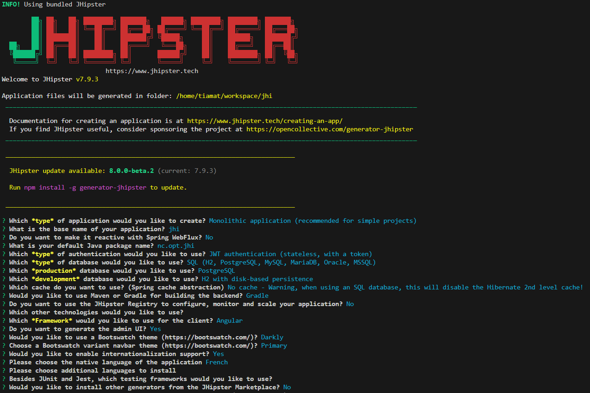

# DEVOPS

Guides sur la thématique DEVOPS (Linux, Docker, K8S, Minikube, Helm, Anthos...)

## Installer Linux Ubuntu sur Windows 10

Aller dans le `menu Windows` > `Activer ou désactiver des fonctionnalités Windows` et cocher la case `Sous-système Windows pour Linux` ainsi que `Hyper-V`.

Depuis le `Microsoft Store`, installer la dernière version de Ubuntu.

## Installer Git

```bash
# Installer git
sudo apt install git -y

# Configurer
git config --global user.name tiamat-azure && \
git config --global user.email tiamat.azure@gmail.com

# Vérifier
git --version && \
git config --global --list
```

## Ajouter les autorités de certification de l'entreprise (optionnel)

```bash
# Copier les certificats préalablement récupérés
sudo cp *.crt /usr/local/share/ca-certificates/

# Vérifier
ls /usr/local/share/ca-certificates/

# Ajouter
sudo update-ca-certificates
```

## Installer ZSH

> :notebook: doc: [instaling-zsh](https://github.com/ohmyzsh/ohmyzsh/wiki/Installing-ZSH)

```bash
sudo apt install zsh

# Version check
zsh --version

# Make it your default shell
chsh -s $(which zsh)
```

## Installer Oh My Zsh

```bash
sh -c "$(curl -fsSL https://raw.githubusercontent.com/ohmyzsh/ohmyzsh/master/tools/install.sh)"
```

Configurer ces plugins dans `~/.zshrc` :

```bash
plugins=(
    git 
    dirhistory
    emoji
    python
    sudo
    ubuntu
    timer
    minikube
    docker
    docker-compose
    sdk
    node
    npm
)
```

Configurer ces alias dans `~/.zshrc` :

```bash
#======================================#
# Aliases
#======================================#

# Reload ~/.bashrc
#alias sourceb="source ~/.bashrc"
alias sourcez="source ~/.zshrc"

# Show my ip address
alias myip="curl http://ipecho.net/plain; echo"

# mkdir && cd
alias mkcd='foo(){ mkdir -p "$1"; cd "$1" }; foo'

# git add all, commit with comments then push function
alias gcp='_gcp(){ git add .; git commit -m "$1"; git push; git status }; _gcp'

# npm
alias nis="npm install --save "

## VS Code
alias coden='code -n .'
alias codel='code --list-extensions'
alias codei='code --install-extension'
alias codeu='code --uninstall-extension'

## get rid of command not found ##
alias cd..='cd ..'

# a quick way to get out of current directory
alias ..='cd ..'
alias ...='cd ../../../'
alias ....='cd ../../../../'
alias .....='cd ../../../../'
alias .4='cd ../../../../'
alias .5='cd ../../../../..'

# handy short cuts #
alias c='clear'
alias h='history'
alias hs='history | grep'
alias j='jobs -l'

# Stop after sending count ECHO_REQUEST packets
alias ping='ping -c 5'
# Do not wait interval 1 second, go fast
alias fastping='ping -c 100 -s.2'

# APT commands
alias apt="sudo apt"
alias apti="sudo apt install -y"
alias aptu="sudo apt update"
alias aptui="sudo apt update && sudo apt install -y "
alias aptfu="sudo apt full-upgrade -y"
alias aptar="sudo apt auto-remove -y"
alias aptsys="sudo apt-get install unattended-upgrades"
alias aptrepo="sudo add-apt-repository"

# update packages
alias apt-get="sudo apt-get"

# update on one command
alias update='sudo apt-get update && sudo apt-get upgrade && sudo apt-get dist-upgrade && sudo apt auto-remove'
alias updatey='sudo apt-get update --yes && sudo apt-get upgrade --yes && sudo apt-get dist-upgrade --yes && sudo apt auto-remove'
alias updatesys="sudo apt-get install unattended-upgrades"
alias updateall='sudo apt-get update --yes && sudo apt-get upgrade --yes && sudo apt-get dist-upgrade --yes && sudo apt-get install unattended-upgrades && sudo apt auto-remove'

# become root
alias root='sudo -i'
alias su='sudo -i'

# NGINX
alias nginxreload='sudo /usr/local/nginx/sbin/nginx -s reload'
alias nginxtest='sudo /usr/local/nginx/sbin/nginx -t'

# pass options to free
alias meminfo='free -m -l -t'

# get top process eating memory
alias psmem='ps auxf | sort -nr -k 4'
alias psmem10='ps auxf | sort -nr -k 4 | head -10'

# get top process eating cpu
alias pscpu='ps auxf | sort -nr -k 3'
alias pscpu10='ps auxf | sort -nr -k 3 | head -10'

# Get server cpu info
alias cpuinfo='lscpu'

# set some other defaults
alias df='df -hPT | column -t'
alias du='du -ch'

# Date and Time Aliases
alias d='date +"%F"'
alias now='date +"%F %T"'

# GitHub
GH_USER="tiamat-azure"
GH_REPO=""
GH_TOKEN=""

# Prise en compte de l'option -p dans zsh
# setopt multios

# Créer une issue sur GitHub
function issue() {

    # Demander les informations nécessaires à l'utilisateur
    # read -p "Issue title: " title
    echo "Issue title: "
    read title
    body=""

    # Créer l'issue en utilisant l'API GitHub
    number=$(curl -s -X POST -H "Authorization: token $GH_TOKEN" -d "{\"title\":\"$title\",\"body\":\"$body\"}" "https://api.github.com/repos/$GH_USER/$GH_REPO/issues" | jq -r '.number')
    echo "Issue crée #$number"
}

# Plugins oh-my-zsh
alias zp='ls ~/.oh-my-zsh/plugins'
alias zpi='ls ~/.oh-my-zsh/plugins | grep '
```

## Installer GitHub CLI

```bash
# Installer
type -p curl >/dev/null || (sudo apt update && sudo apt install curl -y)
curl -fsSL https://cli.github.com/packages/githubcli-archive-keyring.gpg | sudo dd of=/usr/share/keyrings/githubcli-archive-keyring.gpg \
&& sudo chmod go+r /usr/share/keyrings/githubcli-archive-keyring.gpg \
&& echo "deb [arch=$(dpkg --print-architecture) signed-by=/usr/share/keyrings/githubcli-archive-keyring.gpg] https://cli.github.com/packages stable main" | sudo tee /etc/apt/sources.list.d/github-cli.list > /dev/null \
&& sudo apt update \
&& sudo apt install gh -y

# Configurer
gh auth login
```

## Installer Docker

> :bulb: L'idée : installer Docker Desktop sur l'hôte Windows 10 et exploiter le WSL 2 pour l'intégration avec Linux Ubuntu

:notebook: Référence : <https://docs.docker.com/desktop/wsl/>

Depuis **Windows**, télécharger, installer [Docker Desktop for Windows](https://desktop.docker.com/win/main/amd64/Docker%20Desktop%20Installer.exe) et cocher la case WSL (2).

Depuis **Ubuntu** et **Windows**, tester l'installation avec la même commande :

```python
# Télécharger et exécuter une image Docker
docker run hello-world
```

## Installer Minikube

> Références :
>
> - :notebook: <https://minikube.sigs.k8s.io/docs/start/>
> - :notebook: <https://minikube.sigs.k8s.io/docs/handbook/controls/>

```python
# Télécharger
curl -LO https://storage.googleapis.com/minikube/releases/latest/minikube-linux-amd64

# Installer
sudo install minikube-linux-amd64 /usr/local/bin/minikube

# Démarrer
minikube start

# Vérifier
kubectl get po -A

# Forcer minikube à télécharger la version adéquate de kubectl
minikube kubectl -- get po -A

# Lancer le dashboard
minikube addons enable metrics-server
minikube dashboard

# Déployer un serveur avec kubectl
kubectl create deployment hello-minikube --image=kicbase/echo-server:1.0

# Exposer le serveur
kubectl expose deployment hello-minikube --type=NodePort --port=8080

# Ouvrir le serveur dans le navigateur
minikube service hello-minikube

# Démarrer un second cluster
minikube start -p cluster2

# Arrêter un cluster
minikube stop

# Supprimer un cluster
minikube delete

# Arrêter un cluster spécifique
minikube stop -p cluster2

# Supprimer tous les clusters
minikube delete --all
```

## Installer SDKMAN

```bash
# Pré-requis
apti unzip zip

# Install
curl -s "https://get.sdkman.io" | bash

# Apply
source "$HOME/.sdkman/bin/sdkman-init.sh"

# Check version
sdk version
```

## Installer Java

```bash
# Rechercher
sdk ls java

# Installer
sdk i java 17.0.8-tem

# Vérifier
java -version
javac -version
```

## Installer Gradle

```bash
# Rechercher
sdk ls gradle

# Installer
sdk i gradle 8.2.1

# Vérifier
gradle -v
```

## Installer NVM / Node

```bash
# Installer nvm
curl -o- https://raw.githubusercontent.com/nvm-sh/nvm/v0.39.4/install.sh | bashnode

# Vérifier
nvm ls-remote --lts | grep Latest

# Installer node/npm LTS
nvm install v18.17.0

# Vérifier
node -v
```

## Installer JHipster (avec npm)

```bash
# Installer le générateur JHipster
npm i -g generator-jhipster

# Installer le générateur Yo
npm i -g yo
```

## Créer une application JHipster

```bash
# Créer le répertoire
mkcd jhi

# Lancer le générateur
jhipster

# Répondre aux questions
```



```bash
# Droit en exécution
chmod +x ./gradlew

# Lancer l'application
./gradlew

# Arrêter l'application
CTRL+C

# Créer les GitHub Actions
jhipster ci-cd

# Créer le repo dans GitHub
gh repo create jhi --public --source=. --remote=upstream

# Pousser le code
git remote add jhi https://github.com/tiamat-azure/jhi.git
git push jhi

# Conteneuriser l'application
npm run java:docker

# Lancer l'application et ses dépendances (base de données)
docker-compose -f src/main/docker/app.yml up -d

# Arrêter l'application et ses dépendances (base de données)
docker-compose -f src/main/docker/app.yml stop

# Supprimer l'application et ses dépendances (base de données)
docker-compose -f src/main/docker/app.yml down

# Intégrer avec k8s
jhispter k8s
```
